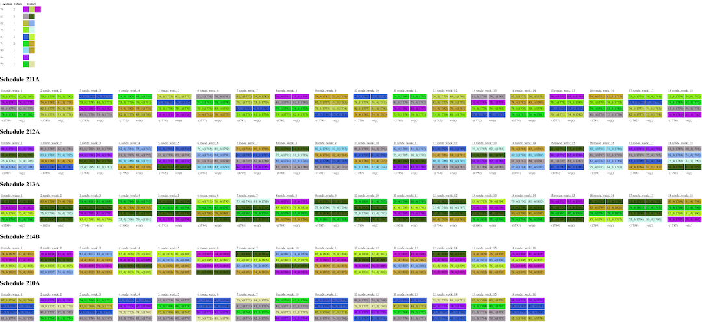
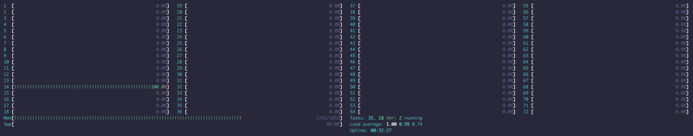

# Applications to generate permutations of schedules

## Setup
1. `dotnet restore`

## Deployment
SQLServer is used to persist the generated permutations and schedule. It also helps generate schedules by using cross joins to make the Cartesian product of the data.

When running the projects an sophisticated server would speed up the process. Having at least 2 cores and 6gb RAM is recommended for SQL server to perform smoothly.
Run the following commands when setting up an server:

Local:
1. `dotnet publish -c Release -r linux-x64 --self-contained true`
2. Copy output of the release folders(MultiThreadedPermutations and Aggregator) to central hosting like AWS S3.

Server:
1. `wget https://my-bucket.s3-eu-west-1.amazonaws.com/Aggregator.zip` 
2. `wget https://my-bucket.s3-eu-west-1.amazonaws.com/MultiThreadedPermutations.zip` 
3. `unzip Aggregator.zip -d Aggregator` 
4. `unzip MultiThreadedPermutations.zip -d MultiThreadedPermutations`
5. [Install SQL server](https://docs.microsoft.com/en-us/sql/linux/quickstart-install-connect-ubuntu?view=sql-server-ver15)
6. [Patch the installation](https://stackoverflow.com/questions/57265913/error-tcp-provider-error-code-0x2746-during-the-sql-setup-in-linux-through-te)
7. start the permutations in the background:
```shell
./MultiThreadedPermutations/MultiThreadedPermutations abcdefghijkl > MultiThreadedPermutations_output.log 2>&1 &
```
8. when the permutations are finished(check `MultiThreadedPermutations_output.log`) start the Aggregator:
```shell
./Aggregator/Aggregator > Aggregator_output.log 2>&1 &
```
9. When the Aggregator(check `Aggregator_output.log`) retrieve the results from the database

## Results based on data


## Without multi-threaded approach

